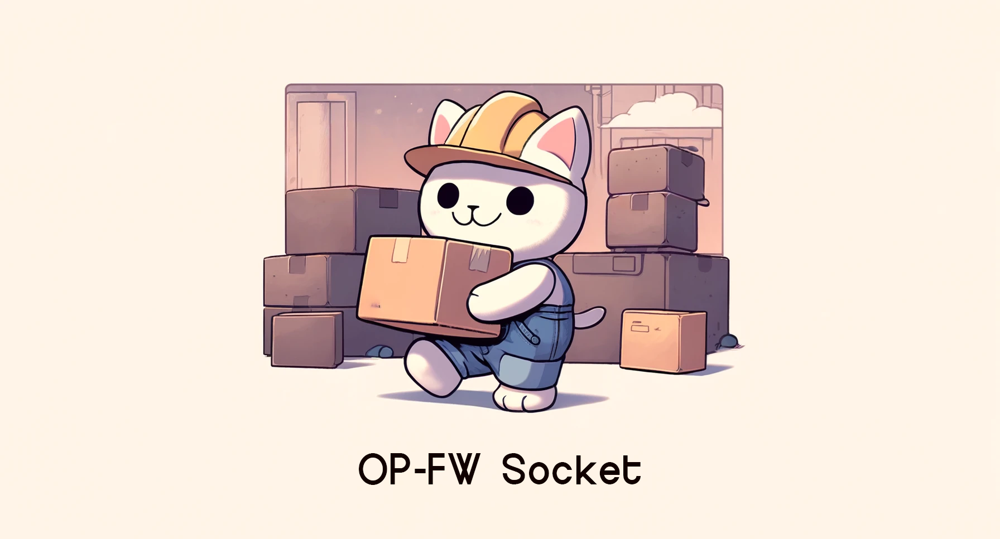

## Overview

OP-FW Socket is a bun application designed to integrate with the [OP-FW Admin](https://github.com/coalaura/opfw-admin) panel, enhancing its functionality by providing real-time data and interaction capabilities. This backend service plays a crucial role in managing and broadcasting the live positional data of players within the OP-FW framework, a custom solution tailored for OP-FW FiveM servers. It basically acts as a proxy between the OP-FW Admin panel and the OP-FW API on the FiveM server(s).

## Requirements
- [bun](https://bun.sh/) v1.1.34 or higher
- At least 2GB of memory (or swap)
- The [storage server](https://github.com/coalaura/admin-panel-storage)

## Configuration
Create a file in the root of the directory called `_config.json`. This is how it should look like (configure to your environment):

```json
{
    "panel": "/path/to/opfw-admin",
    "storage": "localhost:4994",
    "servers": [
        "c1", "c2"
    ],
    "twitch": {
        "api": "https://op-framework.com/api/twitch/streamers/%s",
        "streamers": [
            "inzidiuz",
            "coalaura",
            "northbayjoe"
        ]
    },
    "timeout": 5000,
    "lifetime": 10
}
```

**NOTE:** Make sure the `storage` points to the [storage server](https://github.com/coalaura/admin-panel-storage), otherwise historic data will not be available. Leave it empty to not store any historic data at all.

## Swap Space Configuration
```bash
# Check if you already have swap space
swapon --show

# Allocate 2G of swap space
sudo fallocate -l 2G /swapfile
sudo chmod 600 /swapfile
sudo mkswap /swapfile
sudo swapon /swapfile

# Persist swap space
# Add this to the bottom of the file
# /swapfile none swap sw 0 0
nano /etc/fstab
```

## Logrotate Configuration
```bash
nano /etc/logrotate.d/panel_socket
```

```
/var/log/panel_socket.log {
    daily
    missingok
    maxage 7
    compress
    delaycompress
    notifempty
}
```